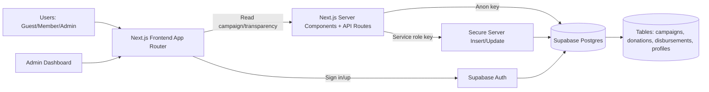
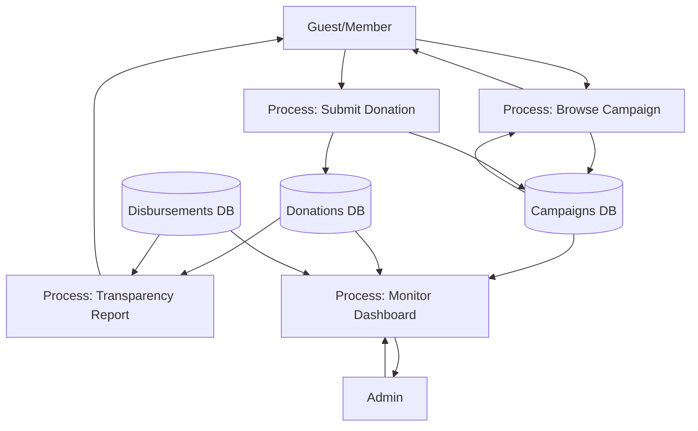
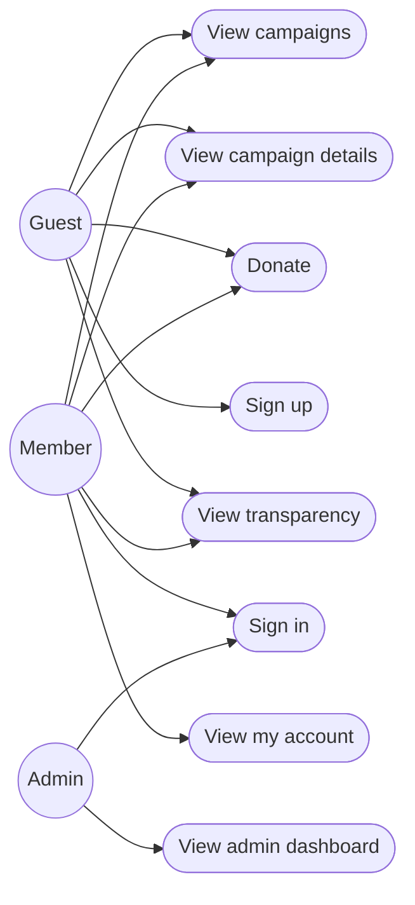
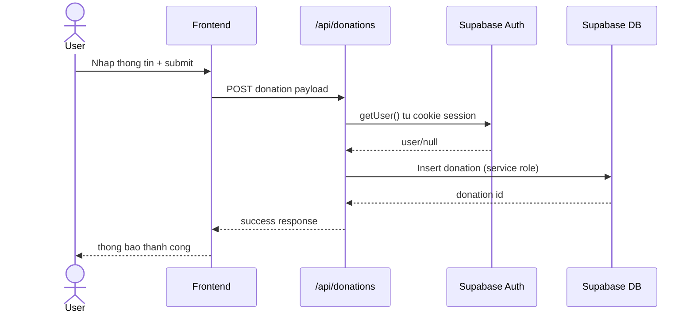

# Seminar 1 - NT208 - TuThien.vn

## 1. Nguoi dung va phan tich nhu cau (Use-cases)

### 1.1 Nhom nguoi dung

1. `Khach vang lai` (chua dang ky)
2. `Thanh vien` (da dang ky tai khoan)
3. `Dieu phoi vien/Admin`
4. `Nha tai tro doi tac` (to chuc muon theo doi bao cao minh bach)

### 1.2 Use-case theo nhom

#### A. Khach vang lai

1. Xem danh sach chien dich.
2. Xem chi tiet chien dich.
3. Xem bang minh bach (nhat ky giai ngan, dong gop gan day).
4. Gui quyen gop nhanh khong can dang nhap.
5. Dang ky tai khoan.

#### B. Thanh vien da dang ky

1. Dang nhap/dang xuat.
2. Cap nhat thong tin profile.
3. Gui quyen gop co gan user.
4. Xem lich su dong gop ca nhan.
5. Theo doi tien do chien dich quan tam.

#### C. Dieu phoi vien/Admin

1. Dang nhap vao khu quan tri.
2. Theo doi KPI tong quan (tong tien, so chien dich, donor count).
3. Theo doi tien do tung chien dich.
4. Xac nhan/doi soat giao dich quyen gop (buoc mo rong o seminar sau).
5. Them cap nhat du lieu bao cao giai ngan.

#### D. Nha tai tro doi tac

1. Truy cap du lieu minh bach de doi soat.
2. Theo doi bao cao tong hop theo chien dich.
3. Danh gia muc do tin cay truoc khi tai tro tiep.

### 1.3 Tinh nang retention (tinh nang "dinh")

1. `Live Donation Feed`: cap nhat dong gop gan realtime.
2. `Transparency-first UX`: minh bach du lieu ngay tren homepage + trang minh bach.
3. `Tai khoan thanh vien`: luu lich su dong gop, tao ly do quay lai.
4. `Campaign progress tracking`: theo doi % hoan thanh va moc tien do.

---

## 2. Phan tich canh tranh va chien luoc khac biet

### 2.1 Doi thu

1. Doi thu truc tiep:
   - thiennguyen.app
   - mot so nen tang gay quy cong dong tai VN
2. Doi thu gian tiep:
   - Facebook/Zalo group gay quy thu cong
   - Chuyen khoan truc tiep qua QR/NGAN HANG khong nen tang

### 2.2 Loi the canh tranh

1. UX "new-wave + modern", toi uu mobile/desktop.
2. Luong minh bach du lieu de doc (campaign -> donation -> disbursement).
3. Kien truc mo de nang cap:
   - Auth
   - role-based admin
   - payment gateway
4. MVP co fallback mode, de demo nhanh va khong phu thuoc env ngay tu dau.

### 2.3 Chong sao chep

1. Tap trung vao quy trinh van hanh minh bach (data model + doi soat), khong chi giao dien.
2. Xay bo tieu chuan du lieu rieng cho campaign/disbursement/proof.
3. Tich hop profile + lich su dong gop + role admin thanh 1 he thong lien mach.
4. Lien tuc xay "trust layer" (audit log, DOI soat, xac minh chung tu) o cac phase sau.

### 2.4 USP (Unique Selling Proposition)

`Nen tang gay quy "transparency-first" cho thi truong sinh vien/nhom nho: vua de dung, vua minh bach, vua co duong nang cap thanh he thong van hanh thuc te.`

---

## 3. So do kien truc he thong (System Architecture)



### Module chinh

1. `Presentation Layer`: trang chu, chien dich, quyen gop, minh bach, quan tri.
2. `Auth Module`: dang ky/dang nhap/dang xuat, session cookie.
3. `Donation Module`: form quyen gop + API `/api/donations`.
4. `Transparency Module`: truy van va hien thi disbursement/donation feed.
5. `Data Layer`: helper Supabase client (server/client/middleware).

---

## 4. Luong du lieu (DFD) va UML

### 4.1 DFD (muc 1)



### 4.2 UML Use-case Diagram



### 4.3 UML Sequence Diagram (quy trinh quyen gop)



---

## 5. Thiet ke co so du lieu

### 5.1 ERD (SQL - PostgreSQL/Supabase)

```mermaid
erDiagram
  campaigns ||--o{ donations : "campaign_id"
  campaigns ||--o{ disbursements : "campaign_slug"
  auth_users ||--|| profiles : "id"
  auth_users ||--o{ donations : "user_id"

  campaigns {
    uuid id PK
    text slug UNIQUE
    text title
    text summary
    bigint target_amount
    bigint raised_amount
    text status
    date end_date
    text cover_tag
    timestamptz created_at
  }

  donations {
    uuid id PK
    uuid campaign_id FK
    uuid user_id FK
    text campaign_slug
    text donor_name
    text email
    bigint amount
    text payment_method
    text message
    text status
    timestamptz created_at
  }

  disbursements {
    uuid id PK
    text campaign_slug
    text title
    text description
    bigint amount
    date spent_at
    text proof_url
    timestamptz created_at
  }

  profiles {
    uuid id PK
    text full_name
    text role
    timestamptz created_at
  }
```

### 5.2 NoSQL

Hien tai khong su dung NoSQL trong MVP (chi su dung PostgreSQL qua Supabase).

---

## 6. MVP, tech stack, quan ly nhom

### 6.1 MVP da co

1. Homepage + campaign list + campaign detail.
2. Quyen gop qua API route.
3. Trang minh bach.
4. Trang quan tri (require login).
5. Dang ky/dang nhap/dang xuat + trang tai khoan.

### 6.2 Tech stack va ly do chon

1. `Next.js 15 + TypeScript`
   - Render linh hoat (server/client), de mo rong production.
2. `Tailwind CSS`
   - Toc do dev nhanh, dong bo design system.
3. `Supabase`
   - Gom Auth + Postgres + RLS trong mot he sinh thai.
4. `Mermaid docs`
   - Ve kien truc/uml nhanh trong markdown.

### 6.3 Minh chung lam viec nhom (can bo sung khi nop)

1. Anh chup Trello/Jira board 1 thang.
2. Log commit Github/Gitlab theo thanh vien.
3. Anh chat nhom (moc timeline task).

---

## 7. Ke hoach cho Seminar #2 va #3

1. Them payment gateway that su (VNPAY/MoMo).
2. Chuan hoa admin workflow: duyet giao dich, cap nhat sao ke.
3. Dashboard nang cao: chart theo ngay/thang, anomaly detection.
4. Audit log va permission theo role chi tiet.
